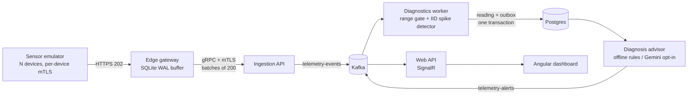

# Industrial Platform

IoT telemetry platform in .NET 10. Simulated machines stream sensor readings through a
store-and-forward edge gateway into Kafka. A per-machine online ML.NET anomaly detector flags
overheats and sensor faults, and an AI diagnosis step turns each anomaly into a finding, a
likely cause, and three corrective steps, shown live on an Angular dashboard. The focus is the
edge: per-device mTLS identities, a durable SQLite outage buffer, and a detector that keeps
working when a sensor reports nonsense.

> Sibling: [TxMonitoringPlatform](https://github.com/chris-straka/TxMonitoringPlatform) began as a
> copy of this repo and was re-themed for fintech. It drops the edge device fleet and the LLM
> and instead covers explainable risk rules, Redis velocity windows, integer-minor-unit money,
> and an end-to-end latency budget. The shared pipeline mechanics (outbox, DLQ, idempotent sink)
> are documented here.



The sensor emulator is deliberately best-effort, like a constrained device: it keeps acquiring
while the network is down and may shed samples when its bounded RAM/retry budget is exhausted.
Once the edge gateway returns `202`, however, the valid reading is on durable local storage and is
retained through cloud and gateway outages until the cloud settles it.

# Quickstart

Docker and Make are the only requirements for the demo path. No API key is needed.

```sh
git clone git@github.com:chris-straka/industrial-telemetry-platform.git
cd industrial-telemetry-platform
make upd
```

The dashboard is at <http://127.0.0.1:5173> and Grafana at <http://127.0.0.1:3000>. Give the
pipeline a few seconds to produce its first readings, then see [The demo](#the-demo) to take the
cloud down and watch the edge buffer absorb the outage.

Diagnosis is offline by default: a deterministic rule-based advisor reads the anomaly row and
the machine's previous 20 readings, computes a robust baseline (median/MAD), and names the
pattern (sensor fault, sudden spike, rising trend, drop, or low-oil overheat). To use Gemini
instead, copy `.env.example` to `.env` and set `DIAGNOSIS_PROVIDER=Gemini` and `GEMINI_API_KEY`.
The Gemini prompt carries the same computed evidence, and a failed or slow call falls back to
the offline text.

# Build and test

```sh
dotnet build IndustrialPlatform.slnx && dotnet test IndustrialPlatform.slnx     # 73 tests
cd src/Industrial.Web.Dashboard && npm ci && npm run lint && npm test && npm run build  # 54 tests
./scripts/e2e.sh                                                                 # needs Docker
```

On Apple Silicon without Rosetta, `brew install protobuf grpc` provides the native `protoc` that
`Directory.Build.props` picks up. Node is pinned to 24 LTS in `mise.toml`.

# Results

Measured on an Apple M4 Mac mini (10 cores, 16 GB), .NET 10.0.401, Release build, while other
builds were running on the machine.

| what | result | command |
| --- | --- | --- |
| Detector on the emulator's fault model (8 devices x 700 readings, seeded, warm-up excluded) | overheats 703/704, dropouts 544/544, false positives 0/4192 | `dotnet test tests/Industrial.Diagnostics.Tests -c Release --filter DetectorQualityTests --logger "console;verbosity=detailed"` |
| Same replay before the range gate | overheats **0/704**: each -999 dropout in the p-value window hid every real overheat | same replay, run before commit `6bb7c0a` added the gate |
| Detector throughput, in-process | ~106K inspections/s (median of 5 runs, range 68K-114K) | same test |
| Test suites | 73 .NET + 54 Angular, all passing | commands above |
| Dashboard initial bundle | 533 kB raw / 121 kB transferred | `npm run build` |

Not measured in this pass: end-to-end throughput and Kafka-to-dashboard latency, because Docker
was not running. `./scripts/e2e.sh` covers the outage, retry, DLQ, outbox, and TLS failure
drills, but it was not re-run for these numbers.

A guided tour of the code with exercises and interview questions is in
[docs/LEARN.md](docs/LEARN.md).

# Data flow

```
sensor-emulator (N devices, mints MessageId + OccurredAt)
                          │ HTTP/JSON, LAN
                          ▼
   ┌─────────────────── edge-gateway ────────────────────┐
   │  receiver ──► SQLite (WAL, fsync per commit)        │
   │                    │                                │
   │                    ▼                                │
   │              uploader ──► oldest-first, batched     │
   │                                                     │
   │  + bounded buffer w/ 429 + Retry-After backpressure │
   │  + exponential backoff w/ jitter                    │
   │  + OTel: queue depth, oldest message age            │
   └────────────────────────┬────────────────────────────┘
                            │ gRPC unary, up to 200 readings a call (HTTP/2 + mTLS), WAN
                            ▼
                        ingestion-api
                            │ produces telemetry-events, keyed by EquipmentId
                            ▼
   ┌───────────────────── Kafka ───────────────────────┐
   │                        ▲                          │
   ▼                        │                          ▼
diagnostics-worker          │                      web-api
 ├─ dedupes on MessageId    │                       ├─ consumes telemetry-events
 ├─ range gate + ML.NET     │                       ├─ consumes telemetry-alerts
 ├─ saves to Postgres       │                       └─ relays live data via SignalR
 ├─ diagnosis advisor       │                                  │
 ├─ poisons ──► telemetry-events-dlq                           │
 └─ alert outbox publisher ─┘                                  ▼
                                                         web-dashboard
```

# Delivery guarantees

The gateway's `202` splits the pipeline into two reliability zones.

Before it, delivery is best-effort. A full sensor channel drops a new sample, and an HTTP send that
exhausts its bounded retry policy drops the dequeued sample. Separate metrics count both.

After it, custody and retry are durable. For a reading that is not deterministically rejected,
delivery through gRPC and Kafka is at-least-once: the gateway has fsynced the reading to SQLite,
ambiguous failures retry, and the reading is deleted only after ingestion names its `MessageId`
accepted. An explicit rejection follows the separate permanent-loss path below.

A deterministic cloud rejection is permanent loss from the live pipeline, not successful
delivery. The gateway atomically preserves the original row in a bounded SQLite quarantine before
settling it; inspect recent entries at `GET /buffer/quarantine?limit=100`. Diagnostics handles a
different poison-record boundary: malformed Kafka values and tombstones are copied to
`telemetry-events-dlq` before their source offsets are committed. If the DLQ write fails or is
ambiguous, the source record is retried.

Every reading carries an immutable `MessageId` minted by the sensor. SQLite protects live and
recently settled gateway IDs; Postgres has a unique index for Kafka replay. Duplicate live events
and alerts are also filtered by a bounded ID window in the dashboard. At-least-once delivery into
an idempotent sink leaves the persisted state effectively-once.

Anomaly publication uses a transactional outbox: the diagnostic row and pending alert commit in
one Postgres transaction, then a separate worker publishes the alert. A crash after Kafka's ACK can
still publish twice, which is why the alert keeps the same `MessageId`.

The pipeline carries two clocks so an outage stays measurable:

| field | whose clock | meaning |
| --- | --- | --- |
| `OccurredAt` | sensor | when the reading was taken (event time) |
| `ReceivedAt` | cloud | when the cloud accepted it (processing time) |

Without `OccurredAt`, readings drained after a 30 minute outage would all claim to have
happened in the seconds it took to flush the queue.

A monotonic `SequenceNumber` makes gaps inside an emulator run visible. The emulator resets it on
restart and can drop samples before `202`, so a Postgres-only count is an audit signal rather than
proof of the downstream guarantee or of an unseen tail.

# The demo

```sh
make demo-help          # prints the whole script
make upd                # everything up, queue depth ~0
make chaos-cloud-down   # kill the cloud; queue climbs, sensors keep producing
make chaos-gateway-kill # kill the gateway too, mid-outage; buffer survives
make chaos-cloud-up     # cloud returns; queue drains oldest-first
make verify             # briefly quiesce sensors, drain the pipeline, and audit IDs/gaps/lag
```

Watch `edge_queue_depth` and `edge_oldest_message_age_seconds` in Grafana while it runs. The audit
temporarily stops any active Compose sensor containers, waits for the edge queue, Diagnostics Kafka
lag, and alert outbox to drain, takes a stable snapshot, then restarts the sensors that were running.
It fails on an empty database, duplicate IDs, or a pipeline that does not drain before the timeout.

For an automated destructive test that does not touch the normal development project:

```sh
./scripts/e2e.sh
```

The isolated Compose harness verifies an ingestion outage plus gateway restart, Postgres consumer
retry, malformed-record DLQ handling, alert-outbox recovery after a Kafka outage, rejection of
a TLS client that does not present the gateway certificate, Postgres TLS with a worker SSL
connection, and Kafka broker rejection of a certless SSL client. It uses a unique Compose project and
volumes on every run.

# Health and local transport security

The gateway and cloud services expose `/health` for process liveness and `/health/ready` for the
dependencies needed to accept new work. Readiness checks Kafka topic/partition availability,
Postgres reachability and current migrations, or SQLite writability as appropriate. Cloud
reachability is a gateway metric rather than gateway readiness: accepting onto local
disk during a cloud outage is its job.

Compose generates a private development CA, an ingestion server certificate, and a gateway client
certificate in separate named volumes. The edge validates the ingestion name and private CA;
ingestion requires the client certificate, validates its client-auth purpose and private CA, and
checks its SHA-256 fingerprint against an allowlist. Identities survive ordinary restarts, while
`docker compose down -v` intentionally destroys and regenerates this local PKI.

Sensor-to-edge traffic uses mutual TLS with per-device certificates. Kafka requires a
per-workload client certificate and enforces topic/group/cluster ACLs (broker and
topic-setup admin are superusers), and the diagnostics worker connects to Postgres with
VerifyFull as a non-superuser role while plaintext TCP is rejected. Observability traffic
remains plaintext and unauthenticated inside the Compose network. See
[Security](docs/Security.md) for the exact boundary and remaining work.

# Install

To run the demo:

- [docker](https://www.docker.com/)
- [Make](https://www.gnu.org/software/make/)

To build and test outside Compose:

- [.NET](https://dotnet.microsoft.com/en-us/download) for `make test` and the individual services
- [Node](https://nodejs.org/en) for the Angular dashboard (Node 24; `npm test`, `npm run dev`)

For the unfinished deployment material, which renders and plans but has never been applied:

- [tilt](https://tilt.dev/)
- [Terraform](https://developer.hashicorp.com/terraform/install)

# Ports

Compose publishes development ports on `127.0.0.1` only.

| service | host port | notes |
| --- | --- | --- |
| web-dashboard | 5173 | Angular dev server (`ng serve`) |
| web-api | 5090 | SignalR hub |
| ingestion-api | 5089 | REST (HTTP/1.1), manual testing only |
| ingestion-api | 5091 | gRPC (HTTPS/HTTP/2); requires the generated gateway client certificate |
| edge-gateway | 5272 | sensor receiver, `/health`, `/health/ready`, and buffer inspection |
| grafana | 3000 | login required (admin); provisioned dashboard, alerts, logs, metrics, and traces |
| kafka-ui | 8080 | |
| pgadmin | 5050 | |

# Notes

Design notes live in [docs/](docs/): [Networking](docs/Networking.md),
[Kafka](docs/Kafka.md), [Observability](docs/Observability.md), [Postgres](docs/DB/Postgres.md),
[SQLite](docs/DB/SQLite.md), [MLOps](docs/ML/MLOps.md), and [Security](docs/Security.md). Known
gaps and planned work are in
[TODO.md](TODO.md).

Docker Compose is the supported runnable/demo path. The checked-in Helm and Terraform material can
be linted, rendered, or planned, but it has not been applied and exercised as a production system.
See the remaining deployment work in [TODO.md](TODO.md) before treating it as deployable
infrastructure.
